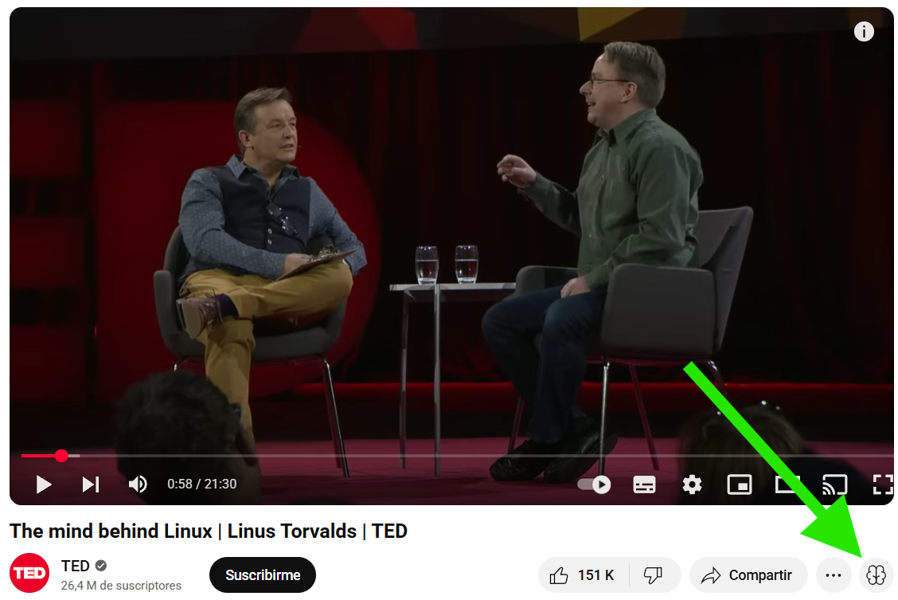
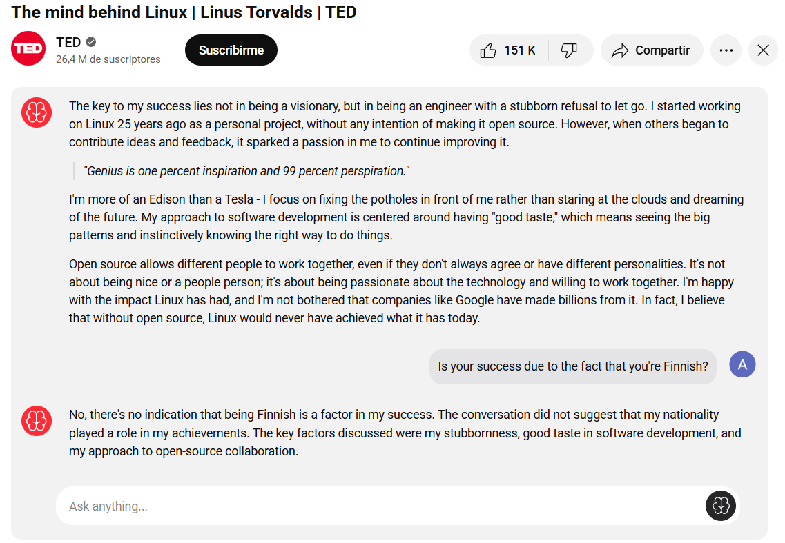

<h1 align="center">TubeSummary</h1>

    

Browser extension to boost YouTube with AI-Powered summaries.

# How it works?
Check out the new brain button at the end of your toolbar, this will trigger summarization.

Below the video, summary will be generated, you can even ask the AI about the video.

# API providers
To archieve this is mandatory to setup a OpenAI compatible API provider, you can use a paid one if you are subscribed or you can check this [list of free LLM resources](https://github.com/cheahjs/free-llm-api-resources)

## Tested services
This is a list of providers that have been tested with this extension, all of them have a free tier.

### Openrouter
- Endpoint url: `https://openrouter.ai/api/v1/`
- Docs: `https://openrouter.ai/docs/api-reference/overview`

### Cerebras
- Endpoint url: `https://api.cerebras.ai/v1/`
- Docs: `https://inference-docs.cerebras.ai/introduction`

### Groq
- Endpoint url: `https://api.groq.com/openai/v1`
- Docs: `https://console.groq.com/docs/api-reference`

### Together AI
- Endpoint url: `https://api.together.xyz/v1/`
- Docs: `https://api.together.ai/models`

### Groq
- Endpoint url: `https://api.groq.com/openai/v1`
- Docs: `https://github.com/marketplace/models`

### Gemini (Doesn't work yet!)
Looks like google openai implementation is still on beta and it didn't work yet
- Endpoint url: `https://generativelanguage.googleapis.com/v1beta/openai/`
- Docs: `https://ai.google.dev/gemini-api/docs/openai`

# Contributing

## Donations
If you like this extension you can contribute buying me a cofee or whatever you want, that would be really great :)

    
    

## PR
Of course PRs are welcome, this extension uses a basic typescript + vite + preact + tailwind stack. Ask me if you have any questions.