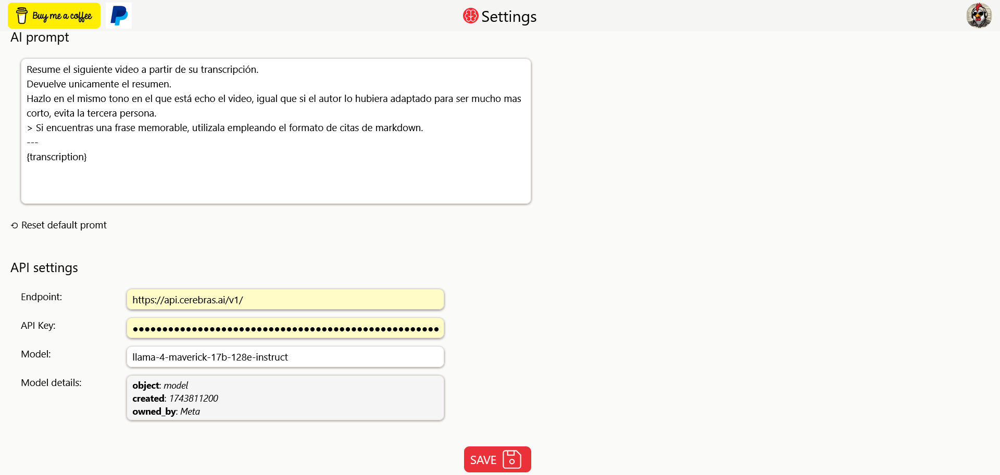

<h1 align="center">TubeSummary</h1>

  

  <b>AI-powered YouTube summaries in your browser</b>

  <i>Boost your learning and productivity by quickly extracting key insights from any YouTube video.</i>

---

## Table of Contents

- [Features](#features)
- [How It Works](#how-it-works)
- [Supported API Providers](#supported-api-providers)
- [Installation](#installation)
- [Contributing](#contributing)
- [Donations](#donations)

---

## Features

- Summarize YouTube videos instantly with a single click
- AI-powered follow-up Q&A below the video
- Support for multiple LLM providers (OpenAI-compatible)
- Prompts and provider credentials fully customizable
- Works on latest Firefox, Chrome, and more

---

## How It Works

1. **Trigger Summarization:**  
   Click the **Brain** button at the end of your YouTube toolbar to generate a summary for the current video.
      
   
 

2. **View the Summary and Interact:**  
   The summary appears below the video. You can ask the AI follow-up questions about the content.
     
   
 

3. **Access Settings:**  
   Click the extension icon, or middle-click **Summarize**, to open the settings page in a new tab.
     
   
    
   Here you can:
   - Customize the summarization prompt
   - Enter your API provider credentials
     
4. **Select Model:**  
   After providing credentials, supported providers let you select available models and view further details.

---

## Supported API Providers

> *An OpenAI-compatible API provider is required. Both free and paid options are supported.  
> See this [list of free LLM APIs](https://github.com/cheahjs/free-llm-api-resources) for alternatives.*

Tested providers (all offer a free tier as of writing):

| Provider      | Endpoint URL                               | Documentation                                   |
|---------------|--------------------------------------------|-------------------------------------------------|
| OpenRouter    | `https://openrouter.ai/api/v1/`            | [Docs](https://openrouter.ai/docs/api-reference/overview)  |
| Cerebras      | `https://api.cerebras.ai/v1/`              | [Docs](https://inference-docs.cerebras.ai/introduction)    |
| Groq          | `https://api.groq.com/openai/v1`           | [Docs](https://console.groq.com/docs/api-reference)        |
| Together AI   | `https://api.together.xyz/v1/`             | [Docs](https://api.together.ai/models)                     |
| GitHub Models | `https://models.github.ai/inference`       | [Docs](https://github.com/marketplace/models)               |
| Gemini *(not yet supported)* | `https://generativelanguage.googleapis.com/v1beta/openai/` | [Docs](https://ai.google.dev/gemini-api/docs/openai) |

---

## Installation

### Firefox

Install directly from the Firefox Add-ons page:

### Chrome

1. Go to [latest release](https://github.com/n0vella/TubeSummary/releases/latest)
2. Download and unpack the zip file
3. Navigate to `chrome://extensions/`
4. Enable Developer mode
5. Click "Load unpacked" and select the extension folder

---

## Contributing

Contributions and pull requests are encouraged! The codebase uses TypeScript + Vite + Preact + Tailwind.  
If you have questions, feel free to open an issue.

---

## Donations

If you find TubeSummary useful, you can support further development:

  
  &nbsp;
  

---

